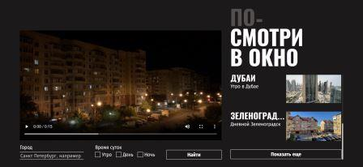
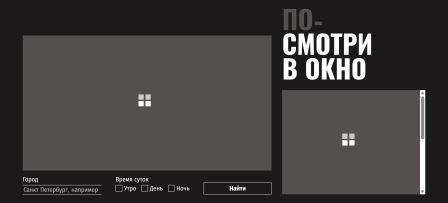
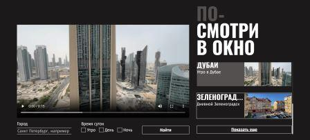
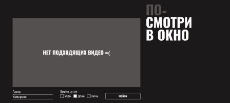

# Учебный проект в Яндекс Прктикуме "Посмотри в окно"

[Ссылка на макет](https://www.figma.com/design/ApJjZAA3pBv2tCZM9E2ul2/2-спринт.-Посмотри-в-окно?node-id=1-186&t=TS1WKqF7Kw9DXjZP-0 "Выполнен в Figma.com")

[Ссылка на проект](https://github.com/KlokovIgor1986/posmotri-v-okno-fd.git "Хранится на GitHub.com")
## Описание проекта
В проекте создаётся веб-приложение для поиска и просмотра видеороликов, в которых люди из разных городов мира записывают на камеру вид из окна в разное время суток. Пользователь получает условную возможность выглянуть из окна дома этих людей.

Для поиска видеороликов нужно написать в текстовом поле город и выбрать время суток кликая по чекбоксам (утро, день, ночь), а затем нажать кнопку "Найти". При обновлении и загрузке страницы в течении времени поиска в список и видеоплеер выводится прелоадер.

Справа будет список с первыми найденными пятью миниатюрами видеороликов, у каждой из которых есть свой заголовк и описание. Список имеет скролбар и кнопку "Показать ещё", при нажатии на которую в списке появиться ещё пять дополнительных роликов подходящих по критериям поиска. При наведении курсора мыши на элемент его текст будет подчёркнут.

Ролик можно выбрать при помощи мыши, тачпада или клавиши Enter. Он откроется в видеоплеере в центре и изменит цвет фона в списке. В видеоплеере нужно использовать встроенный интерфейс для просмотра ролика, перемотки или паузы, выбора громкости и скорости воспроизведения, а также выбора полноэкранного режима. По элементам интерфейса можно перемещаться клавишей TAB, при этом выбранный элемент обводится линией. Сверху над списком роликов находится заголовок сайта, который является призывом к действию. При наведении на все кликабельные элементы (чекбоксы, кнопки, карточки списка и видеоплеер) курсор меняется на "руку" вместо стандартной "стрелочки". Если ведоролики по критериям поиска не найдены, то в видеоплеер выведется соответствующее сообщение, а список исчезнет.

## Особенность проекта
Главное в этой работе - редактирование уже созданного проекта, но важным условием является запрет на редактирование любых его файлов кроме style.css, а также сохранение общего стиля кода в файле стилей. Необходимо изменить внешний вид интерфейса в соответсвии с брифом, добавив ему большей отзывчивости на действия пользователя. В проекте встречается компонентный подход, работа с состояниями, типографикой, цветовой палитрой и адаптивностью.
### Использованные технологии
1. CSS;
1. Выравнивание с flexbox;
2. Логические размеры и отступы inline-size, block-size, padding-block, padding-inline, margin-block, margin-inline;
3. Псевдоэлементы ::after, ::-webkit-scrollbar, ::-webkit-scrollbar-track, ::-webkit-scrollbar-thumb;
4. Псевдоклассы :focus, :focus-visible (совместно с appearance, -webkit-appearance, -moz-appearance), :has(), :hover, :active и :checked;
5. Глобальные переменные в :root;
6. Кликабельность элементов с помощью cursor: pointer;
7. Обрезка многостррочного текста -webkit-line-clamp с -webkit-box-orient и -webkit-box;
8. Комментарии #region для разделения стилей на группы.

## Инструкция по использованию проекта
* В начале файла стилей в :root пристуствует блок глобальных переменных для быстрой настройки параметров шрифтов, цветовой палитры и элементов.
* В соответствии с настройками и внутренней логикой работы браузера, при получении элементом input type='text' фокуса по клику мыши сработает не только правило CSS с псевдоклассом :focus, но может сработать и правило с псевдоклассом :focus-visible даже при отключении окружения с appearance, -webkit-appearance, -moz-appearance. Об этой особенности работы псевдоклассов указанно в документации https://www.w3.org/TR/selectors-4/#the-focus-visible-pseudo. Выполнить требование брифа с обводкой элемента для input type='text' только при получении фокуса по нажатию клавиши TAB технически невозможно, так как такое решение будет работать не всегда.
