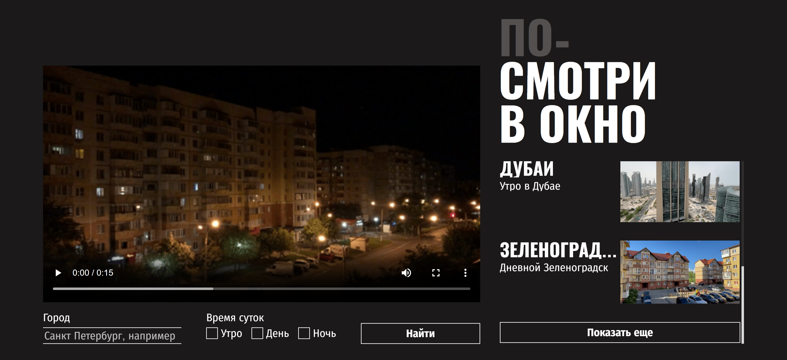
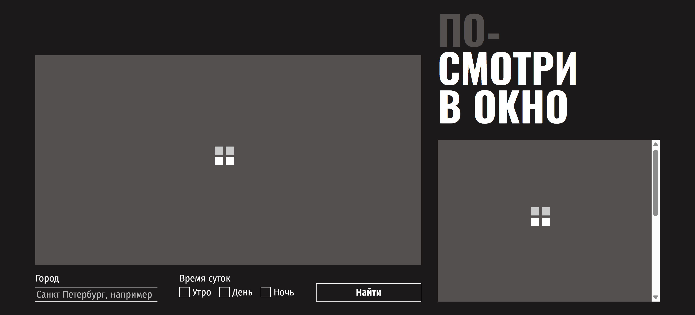
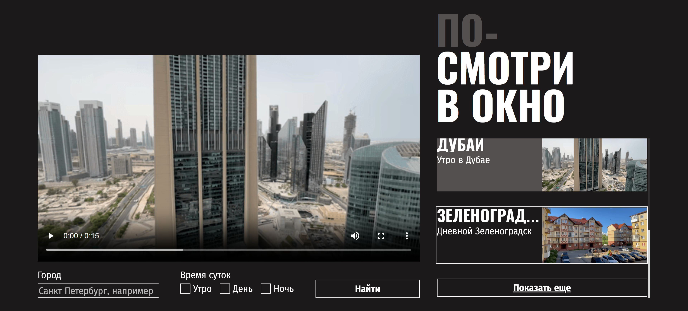
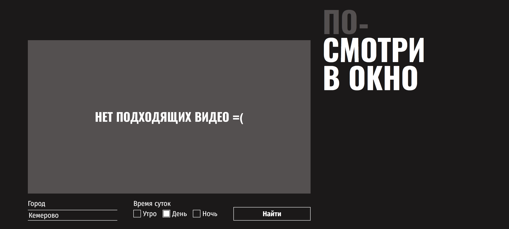

# Учебный проект в Яндекс Практикуме "Посмотри в окно"

[Ссылка на макет](https://www.figma.com/design/ApJjZAA3pBv2tCZM9E2ul2/2-спринт.-Посмотри-в-окно?node-id=1-186&t=TS1WKqF7Kw9DXjZP-0 "Выполнен в Figma.com")

[Ссылка на проект](https://github.com/KlokovIgor1986/posmotri-v-okno-fd.git "Хранится на GitHub.com")
## Описание проекта
В проекте создаётся веб-приложение для поиска и просмотра видеороликов, в которых люди из разных городов мира записывают на камеру вид из окна в разное время суток. Пользователь получает условную возможность выглянуть из окна дома этих людей.

<<<<<<< HEAD


Для поиска видеороликов нужно написать в текстовом поле город и выбрать время суток кликая по чекбоксам (утро, день, ночь), а затем нажать кнопку "Найти". При обновлении и загрузке страницы в течении времени поиска в список и видеоплеер выводится прелоадер.


=======


Для поиска видеороликов нужно написать в текстовом поле город и выбрать время суток кликая по чекбоксам (утро, день, ночь), а затем нажать кнопку "Найти". При обновлении и загрузке страницы в течении времени поиска в список и видеоплеер выводится прелоадер.


>>>>>>> c0a46ff87e0a13c51f6e805e5f8c00e465b4565e

Справа будет список с первыми найденными пятью миниатюрами видеороликов, у каждой из которых есть свой заголовок и описание. Список имеет скроллбар и кнопку "Показать ещё", при нажатии на которую в списке появятся ещё пять дополнительных роликов подходящих по критериям поиска. При наведении курсора мыши на элемент его текст будет подчёркнут.

<<<<<<< HEAD

=======

>>>>>>> c0a46ff87e0a13c51f6e805e5f8c00e465b4565e

Ролик можно выбрать при помощи мыши, тачпада или клавиши Enter. Он откроется в видеоплеере в центре и изменит цвет фона в списке. В видеоплеере нужно использовать встроенный интерфейс для просмотра ролика, перемотки или паузы, выбора громкости и скорости воспроизведения, а также выбора полноэкранного режима. По элементам интерфейса можно перемещаться клавишей TAB, при этом выбранный элемент обводится линией. Сверху над списком роликов находится заголовок сайта, который является призывом к действию. При наведении на все кликабельные элементы (чекбоксы, кнопки, карточки списка и видеоплеер) курсор меняется на "руку" вместо стандартной "стрелочки". Если видеоролики по критериям поиска не найдены, то в видеоплеер выводится соответствующее сообщение, а список исчезнет.



### Структура проекта
```CSS
.
├── README.md
├── index.html
├── fonts/
│   ├── FiraSansCondensed-Bold.woff
│   ├── FiraSansCondensed-Bold.woff2
│   ├── FiraSansCondensed-Regular.woff
│   ├── FiraSansCondensed-Regular.woff2
│   ├── Oswald-Bold.woff
│   ├── Oswald-Bold.woff2
│   └── fonts.css
├── README/
│   ├── main.png
│   ├── no_found.png
│   ├── preloader.png
│   └── select.png
├── scripts/
│   └── script.js
└── styles/
    ├── error.css
    ├── preloader.css
    └── style.css
```

<<<<<<< HEAD
=======

>>>>>>> c0a46ff87e0a13c51f6e805e5f8c00e465b4565e

## Особенность проекта
Главное в этой работе - редактирование уже созданного проекта, но важным условием является минимальное редактирование его файлов кроме style.css, а также сохранение общего стиля кода в файле стилей. Необходимо изменить внешний вид интерфейса в соответствии с брифом, добавив ему большей отзывчивости на действия пользователя. В проекте встречается компонентный подход, работа с состояниями, типографикой, цветовой палитрой и адаптивностью. Ниже описаны моменты вызвавшие наибольшие трудности.

### Шрифты
В работе использован шрифт "Fira Sans Condensed" подгружаемый из файлов *.woff и *.woff2 проекта. Браузеры отрисовывают шрифт с большим кернингом и пробелами чем в Figma.com. Компенсировать это можно только отрицательными значениями letter-spacing и word-spacing, но это является плохой практикой.

### Размеры блока заголовка и текстового поля
Для заголовка сайта "Посмотри в окно" и текстового поля "Город" задана высота в относительных единица em, чтобы не нарушать адаптивность и выставить отступы для соответствия макету. Блок заголовка увеличивает высоту контента при добавлении любых вертикальных отступов, а текстовое поле имеет границы, которые не будут совпадать с макетом.

### Псевдоклассы :focus и :focus-visible
В соответствии с настройками и внутренней логикой работы браузера, при получении элементом input type='text' фокуса по клику мыши сработает не только правило CSS с псевдоклассом :focus, но может сработать и правило с псевдоклассом :focus-visible. Об этой особенности работы псевдоклассов указано в документации https://www.w3.org/TR/selectors-4/#the-focus-visible-pseudo. Полноценно выполнить требование брифа с обводкой элемента для input type='text' только при получении фокуса по нажатию клавиши TAB технически невозможно, так как такое решение будет работать не всегда.

### Обрезка многострочного текста и заголовка карточки в списке
Обрезка многострочного текста осуществляется с помощью устаревшей настройки -webkit-box. При этом не требуется фиксированная ширина контейнера.
```CSS
overflow: hidden;
display: -webkit-box;
-webkit-line-clamp: 4; /* количество строк до обрезки */
-webkit-box-orient: vertical; /* направление отсчёта строк */
```
Для обрезки заголовка использовалась настройка white-space: nowrap, но при этом потребовалось ограничить ширину контейнера, который имеет настройку flex-grow: 1.
```CSS
overflow: hidden;
text-overflow: ellipsis; /* троеточие при обрезке */
white-space: nowrap;
```
Чтобы происходила обрезка необходимо обязательно задать минимальную ширину элемента равную нулю.

### Использованные технологии
1. CSS;
2. Выравнивание с flexbox;
3. Логические размеры, отступы и границы
```CSS
inline-size, block-size,
padding-block, padding-inline,
margin-block, margin-inline,
border-block, border-inline.
```
4. Псевдоэлементы
```CSS
::after,
::-webkit-scrollbar,
::-webkit-scrollbar-track,
::-webkit-scrollbar-thumb.
```
5. Псевдоклассы
```CSS
:focus,
:focus-visible,
:has(),
:hover,
:active,
:checked.
```
6. Отключение стандартной стилизации для создание кастомных элементов. Свойство appearance стандартно не везде поддерживается, поэтому добавлены вендорные аналоги.
```CSS
  -webkit-appearance: none;
  -moz-appearance: none;
  appearance: none;
```
7. Глобальные переменные в :root;
8. Кликабельность элементов cursor: pointer;
9. Комментарии #region для разделения стилей на группы.

## Изменения исходного документа HTML
Исходный документ HTML изменён в двух местах для соответствия макету:
* В placeholder исправлена надпись с "Санкт Петербург, например" на "Санкт-Петербург, например". Пропущен дефис.
* Исправлено название кнопки с "Показать еще" на "Показать ещё". Буква е вместо ё.

## Инструкция по использованию проекта
<<<<<<< HEAD
В начале файла стилей в :root присутствует блок глобальных переменных для быстрой настройки параметров шрифтов, цветовой палитры и обводки.

## Совместимость с браузерами
- **Chrome / Edge / Opera (Blink)** — все настройки работают.
- **Safari (WebKit)** — `:has()` работает с версии 16.4; `-webkit-line-clamp` и `::-webkit-scrollbar` поддерживаются.
- **Firefox** — `::-webkit-scrollbar` не поддерживается (нужны `scrollbar-width` и `scrollbar-color`); `:has()` работает с версии 121; `-webkit-line-clamp` работает с версии 68.
=======
* В начале файла стилей в :root пристуствует блок глобальных переменных для быстрой настройки параметров шрифтов, цветовой палитры и элементов.
* В соответствии с настройками и внутренней логикой работы браузера, при получении элементом input type='text' фокуса по клику мыши сработает не только правило CSS с псевдоклассом :focus, но может сработать и правило с псевдоклассом :focus-visible даже при отключении окружения с appearance, -webkit-appearance, -moz-appearance. Об этой особенности работы псевдоклассов указанно в документации https://www.w3.org/TR/selectors-4/#the-focus-visible-pseudo. Выполнить требование брифа с обводкой элемента для input type='text' только при получении фокуса по нажатию клавиши TAB технически невозможно, так как такое решение будет работать не всегда.
>>>>>>> c0a46ff87e0a13c51f6e805e5f8c00e465b4565e
